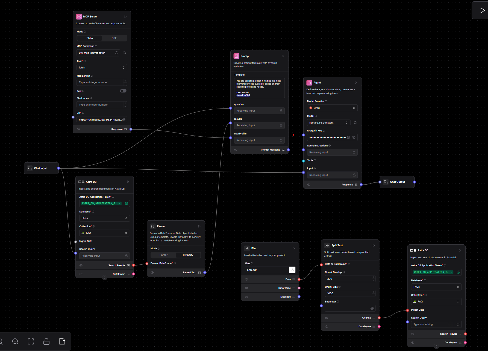

# 🌉 ConnectSJ – Empowering Access Through Technology

**ConnectSJ** is a community-driven platform designed to bridge the gap between San José's homeless population and the vital services they need—delivered through a mobile-friendly, intelligent, and dignified digital experience.

> 🏆 Built during a hackathon to combat fragmented access to food, shelter, jobs, and healthcare.

---

## 🧠 Inspiration

The homelessness crisis in San José and the Bay Area continues to grow, not due to lack of resources—but lack of **accessibility** and **clarity**. We built ConnectSJ to turn fragmented systems into a unified, empowering platform that meets users where they are.

---

## 🚀 What It Does

- 📍 Connects individuals to **verified nearby services**: food, shelter, clinics, transportation.
- 💼 Displays **job opportunities** to help users regain economic independence.
- 🎁 **Incentivizes volunteering** via redeemable points for meals, clothes, haircuts.
- 🤖 Offers an **AI chatbot** that understands needs and offers personalized resources.
- 📊 Tracks **progress, redemptions**, and engagement over time.

---

## 🧩 Key Features

### 🤖 AI Chatbot (Built by Nakshatra)

- Integrated with [Langflow MCP API](https://github.com/logspace-ai/langflow)  
- Handles natural-language queries like:
  > *“Where can I get food tonight?”*, *“Any shelters open now?”*, *“Are there job trainings nearby?”*
- Uses Retrieval-Augmented Generation (RAG) style flow
- Personalized and context-aware responses

📂 Screenshot of MCP flow:


---

## 💻 How We Built It

### Frontend (Built & Integrated by Akshar)

- `React` with `TailwindCSS`
- Mobile-first, responsive design
- `Framer Motion` for animation and enhanced UX
- Token-based user session system

### Backend & API

- `Vercel Serverless Functions` (secure API endpoints, chatbot proxy)
- `Firebase Firestore` for real-time jobs, resources, rewards, and user profiles

### AI Integration (By Nakshatra)

- `Langflow MCP` for orchestrating search, filtering, and chatbot prompts  
- `Sentence Transformers` for semantic understanding  
- Real-time Pinecone-like flow (embedded logic via Langflow backend)

---

## 🌐 Live Deployment

> ✅ [connect-sj.vercel.app](https://connect-sj.vercel.app)

---

## 📁 Folder Structure (Highlights)

```
.
├── .bolt/                  # Chatbot config
├── api/                   # Serverless functions
├── src/                   # React frontend code
├── docs/chatbot_flow/     # Langflow MCP diagram and chatbot logic
├── firebase/              # Resource & reward data
```

---

## 🛠 Tech Stack

- **Frontend**: React, TailwindCSS, Framer Motion  
- **Backend**: Node.js, Vercel Functions  
- **Database**: Firebase Firestore  
- **AI/NLP**: Langflow MCP, Sentence Transformers  
- **DevOps**: Vercel (CI/CD), GitHub, Postman

---

## 🧗 Challenges Faced

- 🛑 **CORS issues** when connecting frontend to Langflow
- 🧱 Structuring flexible **rewards, jobs, and incentives**
- ✅ Ensuring chatbot replies with **real-world verified resources**

---

## ✅ Accomplishments

- 🚀 Full-stack deployment completed during the hackathon  
- 🤖 Real-time **AI chatbot** for resource recommendations  
- 🎁 Fully working rewards system tied to community engagement  
- 📱 Beautiful, intuitive, mobile-first experience  

---

## 🧠 What We Learned

- How **serverless functions** solve real-world integration problems  
- UX/UI design principles for vulnerable user groups  
- Prompt engineering with Langflow for **real-time RAG** flows  
- How to build scalable MVPs focused on real **social impact**

---

## 🔮 What’s Next

- 🤝 Partner with **local nonprofits** to onboard verified data  
- 📲 Add **SMS-based access** for users without smartphones  
- 🛏️ Display **real-time shelter and job availability**  
- 🧑‍⚕️ AI-enhanced case management for long-term plans  
- 🌎 Multilingual support: Spanish, Vietnamese, and more  

---

## 👥 Team Credits

| Name              | Role |
|-------------------|------|
| **Nakshatra Desai** | Built & integrated the AI chatbot using Langflow MCP |
| **Akshar [Last Name]** | Built the React frontend, connected serverless backend, and deployed the full app |

> 🧠 Want to collaborate with us? Feel free to reach out via LinkedIn or GitHub!

---

## 📌 GitHub Topics

`#react` `#firebase` `#langflow` `#vercel` `#pinecone` `#hackathon` `#social-impact` `#ai-chatbot` `#rag` `#typescript`

---

## ✨ Final Words

> **ConnectSJ** isn’t just an app — it’s a bridge from isolation to opportunity.  
> From survival to stability. From silence to support.  
> And we built it with care, for the people who need it most.

